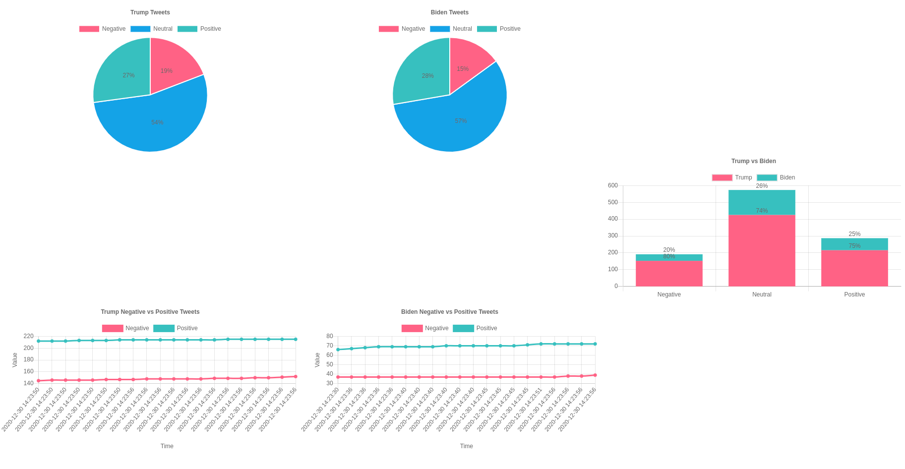

# Twitter Semantic Analysis


# Requirements
This repo requires the following to run:
- Node.js
- Docker and docker-compose
- Python
---
## 1. Getting Started

First, please clone this repo

``` bash
git clone https://github.com/duong19/Twitter-Analysis.git
```

Run this script

``` bash
cd Twitter-Analysis

pip install -r requirements.txt

cd streaming

npm install

```


## 2. Docker

Execute this script to get your docker running
 ```
 docker-compose up --build
 ``` 


Open Pyspark Notebook, run file **Streaming Tweets in Spark.ipynb** then **Streaming Tweets from Hadoop.ipynb**


## 3. Visualize

Go to [this url](https://localhost:5000) to see your graphs

